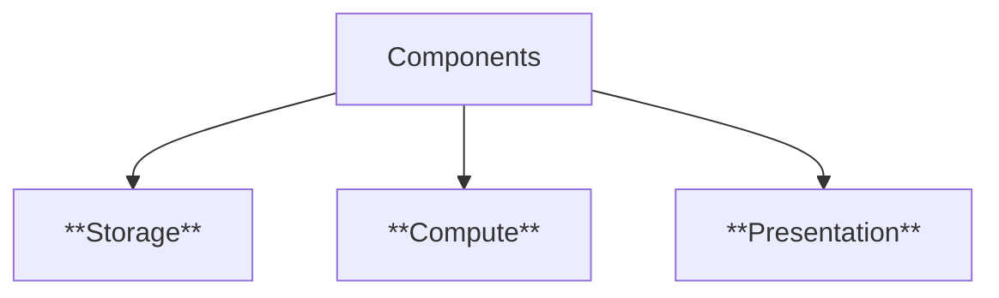

Lecture slides: https://drive.google.com/file/d/1tF4xXmpifRsXBd1YA4Ww5w3xDrvEMfNt/view?usp=sharing

<!--  -->

# App
::: info App
is computer program, originally referred to any mobile or desktop application, but as more "App stores" have emerged to sell mobile apps to smartphone and tablet users, the term has evolved to refer to small programs that can be downloaded and installed all at once.
:::

## Platform: Web-based

| **Aspect / Feature**     | **Desktop Applications**                     | **Mobile Applications**                                        | **Web Applications**                           |
| ------------------------ | -------------------------------------------- | -------------------------------------------------------------- | ---------------------------------------------- |
| **Execution Model**      | Standalone applications installed on a PC    | Network-oriented apps that frequently communicate with servers | runs inside a browser     |
| **Examples**             | MS Word, Photoshop, VLC Media Player         | Instagram, Google Maps                               | Gmail, Google Docs, YouTube                    |
| **Data Storage**         | Mostly local storage + optional network sync *Excel* | Limited local storage (like *WhatsApp chats synced to cloud*)    | Mostly server-side storage (CLOUD datacenters *Google Drive*)       |
| **Hardware Constraints** | High CPU, memory, disk available             | Limited screen, battery, memory, processing power              | Depends on server power, client is lightweight |
| **SDK/ Development**             | OS-specific  Windows SDK, macOS Cocoa                     | OS-specific Android SDK, Flutter or cross-platform                                          | across OS & devices: React, Vue, Django, Flask                      |
| **User Interaction**     | *Keyboard, mouse, files, folders*              | *Touch, audio, tilt gestures, camera*                               | * browser-based UI*              |

**Embedded devices:** single function, limited scope

::: details SDK Software Development Kits
- **Libraries/APIs** → Ready-made code you can reuse instead of writing everything from scratch.
- **Compiler/build tools** → turn your source code into runnable programs.
- **Debuggers** → To find and fix errors.
- **Documentation + Examples →** To guide you on how to use the tools.
- **Emulators / Simulators** → Let you test apps without real devices (Android SDK has phone emulator).
:::

