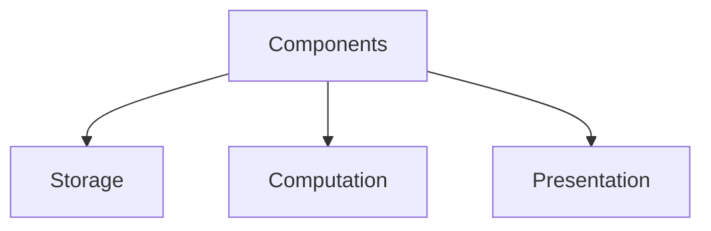
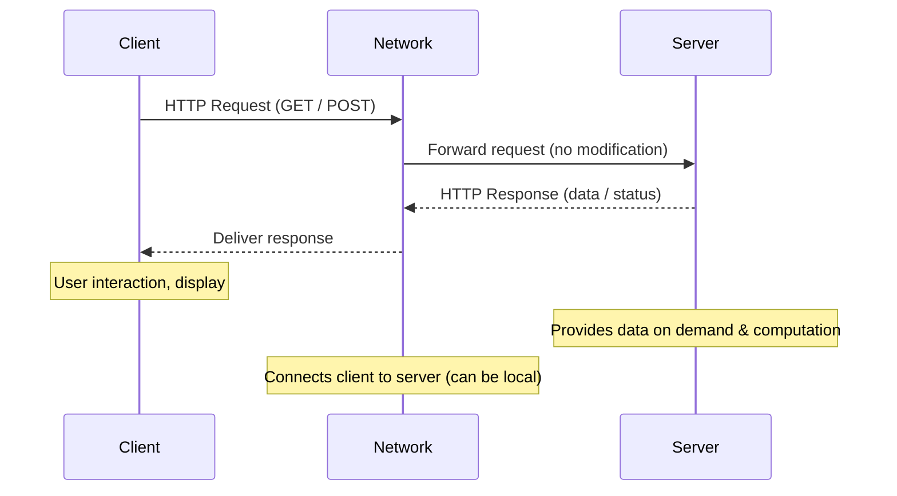
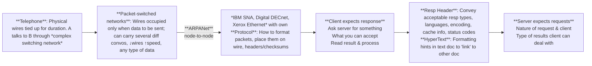
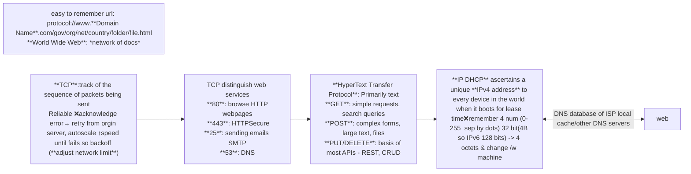

---
tags:
  - T3-2025
  - MAD1
  - W1
date: 2025-09-25 18:22
Lecture slides: https://drive.google.com/file/d/1tF4xXmpifRsXBd1YA4Ww5w3xDrvEMfNt/view?usp=sharing
---

<!--  -->

::: info App
is computer program, originally referred to any mobile or desktop application, but as more app stores have emerged to sell mobile apps to smartphone and tablet users, the term has evolved to refer to small programs that can be downloaded and installed all at once.
:::

## Platform: Web-based
| Desktop                                                   | Mobile Apps                                | Web Apps                                         |
| --------------------------------------------------------- | ------------------------------------------ | ------------------------------------------------ |
| standalone                                                | network oriented                           | heavily *Network cloud* Platform                 |
| local data storage + Network                              | limited screen space, memory/process/power | workarounds for offline processing, *datacenter* |
| **Software Dev Kits(SDK)** OS specific, Custom frameworks | OS specific, cross platform                | across OS, multi-device, common base             |
| Keyboard Mouse, folder, files, docs                       | touchscreen tilt audio camera              | Dynamic Web 2.0                                  |

| **Aspect / Feature**     | **Desktop Applications**                     | **Mobile Applications**                                        | **Web Applications**                           |
| ------------------------ | -------------------------------------------- | -------------------------------------------------------------- | ---------------------------------------------- |
| **Execution Model**      | Standalone applications installed on a PC    | Network-oriented apps that frequently communicate with servers | Heavily cloud-based, runs inside a browser     |
| **Examples**             | MS Word, Photoshop, VLC Media Player         | WhatsApp, Instagram, Google Maps                               | Gmail, Google Docs, YouTube                    |
| **Data Storage**         | Mostly local storage + optional network sync *Excel* | Limited local storage, relies on cloud (like *WhatsApp chats synced to cloud*)    | Mostly server-side storage (datacenters *Google Drive*)       |
| **Hardware Constraints** | High CPU, memory, disk available             | Limited screen, battery, memory, processing power              | Depends on server power, client is lightweight |
| **SDK/ Development**             | OS-specific  Windows SDK, macOS Cocoa                     | OS-specific Android SDK, Flutter or cross-platform                                          | accross OS: React, Vue, Django, Flask                      |
| **User Interaction**     | *Keyboard, mouse, files, folders*              | *Touch, gestures, camera, sensors*                               | *Mouse, keyboard, browser-based UI*              |

**Embedded devices:** single function, limited scope

::: details SDK Software Development Kits
- Libraries/APIs → Pre-written code you can reuse instead of reinventing the wheel.
- Compiler/build tools → To turn your source code into runnable programs.
- Debuggers → To find and fix errors.
- Documentation + Examples → To guide you on how to use the tools.
- Sometimes even an emulator/simulator (like Android SDK has a phone emulator).
:::

## [Architecture: Client ↔ Server](https://em360tech.com/sites/default/files/inline-images/em360tech_client-server-architecture_enterprise-architecture-models.jpg)

- **Machine Client**: Software/antivirus updaters (user interact)
- **Local Systems**: both on same machine*Ex: Databases, Messaging, Browsing*
- Each request is independent — the server doesn’t remember earlier interactions (unless extra mechanisms like *sessions, cookies, or tokens* are used).
## Distributed peer-to-peer

Data can flow in both ways. 
- All peers are considered "**equivalent**"
- **Error Tolerance**
	- Masters/introducers (❌ controller/central)
	- Election/ re-selection of masters on failure of server (a dedicated computer always connected to the Internet, sole purpose is to deliver content) [ON SERVER FAIL RESELECTION]
- Shared ℹ️info
Ex: *bittorrent, Blockchain, Distributed file systems, IPFS, Tahoe*

torrent: download movie, you upload and download also

::: details Design Pattern
A general, reusable solution to a commonly occurring problem within a given context in software design. 
- Designers observe patterns → guide & reuse for faster development
-  Indexed Metadata : when? /w attachments? summarize basic information for tracking
:::

### [Software Architecture: Model-View-Controller](./4-database-layer-MODEL#mvc-model-view-controller)

#### Transmission Control Protocol
65,535 ($2^{16 \text{ bits}}-1$) TCP uses 16-bit unsigned integers for port numbers, allowing values from 0 to 65,535. Port 0 is reserved, so usable ports range from 1 to 65,535.

:::details **Web server**: 
 - Listen for incoming network connections on a **fixed port**
 - Respond in specific ways
 - Opening network connections, ports etc already known to OS
:::

:::details **Protocol**:
- What should client ask server
-  How should server respond to client
:::

#### Status codes

| Category | Status Code | Status Name | Description |
| --- | --- | --- | --- |
|  1xx Informational   | 100 | Continue | Request is in Progress |
| 2xx Success   | 200 OK |  Request was fulfilled | GET, PUT success |
|  | 201 Created | Resource created | POST success |
|  | 204 No Content | No data in response |
| 3xx Redirection   | 301 | Moved Permanently |  |
|  | 302 Found | Moved Temporarily |  |
| 4xx Client Error   | 400 Bad Request | Invalid input | Missing fields or format |
|  | 401 Unauthorized | Not logged in | Token missing |
|  | 403 Forbidden | Server refuses to authorize request, even if client is authenticated | Student accessing admin |
|  | 404 Not Found | Resource missing | Course ID not found |
|  | 415 Unsupported Media Type | Wrong Content-Type | Not JSON |
| 5xx Server Error   | 500 | Internal Server Error | A general error indicating something went wrong on the server |
|  | 502 Bad Gateway | Invalid response from a gateway or proxy | Bug in backend |
|  | 503 Service Unavailable | Overloaded or down | Server down |
|  | 504 | Gateway Timeout |  |

<!-- <ClientOnly> -->
  <StatusCodeSimulator />
<!-- </ClientOnly> -->

| Web 1.0 1990-2000 | Web 2.0 2004-2016 | Web 3 2016- |
| ------- | ------- | ----- |

## [Curl Commands](5-business-logic-layer-CONTROLLER#curl-commands)

::: details TCP, UDP, Proxy, Peer-to-Peer, Broadcast, Unicast, Multicast
- **TCP (Transmission Control Protocol)** is a connection-oriented protocol that ensures reliable, ordered, and error-checked delivery of data between devices on a network through handshakes and acknowledgements.
- **UDP (User Datagram Protocol)** is a connectionless protocol that sends data without establishing a prior connection, prioritizing speed over reliability and not guaranteeing delivery.
- **Proxy** acts as an intermediary server between clients and other servers to facilitate requests, improving security, performance, or anonymity.
- **Peer-to-Peer (P2P)** is a decentralized communication model where each device can act as both client and server, sharing resources directly without central servers.
- **Broadcast** is a one-to-all communication where data is sent from one sender to all devices on a network segment simultaneously.
- **Unicast** is a one-to-one communication where data is sent from one sender to a single specific receiver.
- **Multicast** is a one-to-many communication where data is sent from one sender to multiple specified receivers who join a multicast group, optimizing bandwidth usage.
::: 
