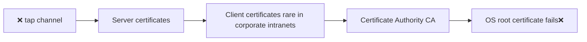

## Access Control
- ❌ all parts for public access (read-only, read-write, modify-only❌ create) 

[list2card]
- **Role-based** ❌ Hierarchical `admin@institute` mail
  User can have multiple roles (Secretary > House RC > Student, Club Member).
- **Attribute-based** time of day, age/citizenship → multiple complex conditions **Policies**
- **Discretionary**: can change file access modes, who you share with static simple checks **Permissions**
- **Mandatory** decision made by centralized management, users ❌ share ℹ️info without permission (military, high-security)

**Policies**: More dynamic, combining multiple conditions unlike static **Permissions**

#### Principle of Least Privilege
entity should have minimal access required to do the job ↑ security ↑ stability ✅ ease of deployment on **sensitive** files ❌ accidentally delete/modify
- **Privilege Escalation**`sudo/su` temporarily change user/gain attribute *explicit logging, extra safety measures*
- ❌ operate as root in Linux
[list2node]
- **hardware** token for access
- **OS** filesystem access, memory segmentation
- **Application lvl** DB server access control
- **Web** Controllers, Decorators in `@app.route Flask` (wrapper only if condition is satisfied execute func)

### Types of Security Checks

[list2node]
- **Obscurity** non-standard port known to specific ppl (if secret out others can easy bypass)
- **Address** host-based access/deny IP address blacklist
- **Login** username/password ❌directly indexed on server ✅hash
- **Tokens** access difficult/impossible to duplicate, machine-to-machine authentication without passwords
- **HTTP server** `401/Unauthorized` less harsh than `404/403 Forbidden` #realm
	- `base64` plaintext can easily decode
	- Server will see cleartext
	- ❌ standard logout process
	- credentials (access token) in the **header** of the next request
- **Form Submission**
	- **GET** URL encoded data insecure, logged can be captured by proxy server ✅spoof 
	- **POST** form multipart data+ HTTPS secure link


- 1 **TCP connection** 1 security check sufficient ↓ overhead `KeepAlive` then each request needs new TCP+auth
- **API key/token** for access machine clients, command line (preferred on non-browser ❌in URL else cookies possible) ✅ `config.py` ❌ source version control
- #### cryptographic function
	- **nonce** *number used only once* prevents spoofing. Client must create a secret unique value ❌spoofing  
	 `MD5(username:realm:password:nonce:method:URI), SHA1, SHA256` one-way function $f(A)=B\text{ near impossible fn }f^{-1}(B)=A$
- ### Client certificates
  secure irreversible certificates provided to each client →client carefully prove knowledge → server #handshake exchange ℹ️info 
## Session Cookie 
  server checks some client credentials with EACH request `Set-Cookie: <cookie-name> =<cookie-value>; Domain=<domain-value>; Secure; HttpOnly` SERVER SESSIONS:

- delete cookie record to logout
- client must send cookies back with every subsequent request
	- client sends multiple server requests "state" ℹ️info
- ❌ sensitive(font, light/dark mode) can be on <span style="font-weight:bold; color:rgb(181, 118, 244)"> client side </span>  (can modify/access)
- ✅sensitive(user permissions, session tokens) stored on the <span style="font-weight:bold; color:rgb(181, 118, 244)"> server side </span> and referenced using an identifier (stored in a cookie) 
	- lookup ℹ️info → Backend DB `redis cache key-value stores`
- timeout + source IP: If someone steals the cookie, ❌impersonate the user.
- JS ❌ read so ❌**cross-site requests CSRF** attacker create page induce auto submit unauthorized requests to another logged-in site (✅verify on server that legitimate start point)
```python
from flask_login import login_required, current_user, logout_user, login_user

app.secret_key =b'_5#y2L"F4Q8z\n\xec]/'

@app.route('/')
def index () :
	if 'username' in session:
		return f'Logged in as {session ["username"] } '
	return 'You are not logged in'

@app.route ('/login' , methods=['GET', 'POST' ] )
	def login():
	if request.method == 'POST':
		session ['username' ] = request.form ['username' ] # Store username
		return redirect (url for ('index' ) )
	return '''<form method="post">
	<p><input type=text name=username>
	<p><input type=submit value=Login>
	</form>'''
@main.route('/profile')
@login_required
def profile() :
	return f'Welcome back {current_user.name}'

@auth.route("/logout")
@login_required
def logout():
	logout_user()
	return redirect(url_for('main.index'))
```

## HTTPS
- open connection to server on fixed network port `default 80` ❌ tap/alter 
- **secure sockets** encrypted channel `long binary string KEY` (`XOR` all input data with key to generate new binary encrypt text)

1.  Server Authentication: ❌ **DNS hijack** → false IP, **chain of trust** entries → redirect to another server


2. Encrypt all **physical wire** communications using **TLS/SSL** protocols ❌ intercepted
3. Client rarely used as stolen certificates → invalid/revocate → ✅ ensure OS, browser update trust stores
4. <span style="color:rgb(240, 96, 118)"> CONS: good in public WiFi Networks but **caching** of resources (proxies cant see resource) **run-time overhead** </span>  `encrypt`↓ performance


**Wildcard**: 1 certificate that secures all subdomains of a domain (e.g., *.google.com)* ↓ secure

## Logging
- built in Apache, Nginx indicate possible security attacks: 
	- $\#$requests/second **↑burst** in short⏲️?
	- URL accessed (malformed?)
	- unusual? endpoints/requests
- Rotation: 
	1. keep last $N$ files
	2. delete oldest file(fixed ↓ space overhead)
	3. rename $\log.i\to\log.i+1$
- Custom: `Google App Engine` gives performance-usage reports, automated security analyses on `log`
- Logs associated with timestamps `time series DB RRDTool, InfluxDV, Prometheus` 
	- **Pattern Detection** periodic spikes/sudden ↑in load
	- **Event Density**$\#$events/s 