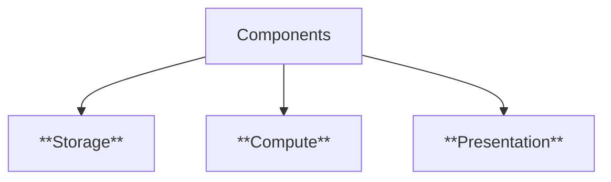

# App
::: info App
An **application (app)** is a computer program designed to perform a specific task for users.
Originally referred to any mobile or desktop application, but with rise of "App stores" for smartphones, the term has evolved for lightweight mobile and web applications that can be easily downloaded and installed.
:::

## Platform: Web-based

| **Aspect / Feature**     | **Desktop Applications**                     | **Mobile Applications**                                        | **Web Applications**                           |
| ------------------------ | -------------------------------------------- | -------------------------------------------------------------- | ---------------------------------------------- |
| **Execution Model**      | Standalone apps installed on a PC    | apps that frequently communicate with servers, few may work **offline** | runs inside a browser     |
| **Examples**             | MS Word, Photoshop, VLC Media Player         | Instagram, Google Maps                               | Gmail, Google Docs, YouTube                    |
| **Data Storage**         | Mostly local storage + optional network sync *Excel* | Limited local storage (like *WhatsApp chats synced to cloud*)    | Mostly server-side storage (CLOUD datacenters *Google Drive*)       |
| **Hardware Constraints** | High CPU, memory, disk available             | Limited screen, battery, memory, processing power              | Depends on server power, client is lightweight |
| **SDK/ Development**             | OS-specific  *Windows* SDK, macOS *Cocoa*                     | OS-specific *Android* SDK, *Swift* or cross-platform like *Flutter*  | across OS & devices: Frontend:*Vue, React* + Backend: *Flask, Django*   |
| **User Interaction**     | *Keyboard, mouse, files, folders*              | *Touch, audio, tilt gestures, camera*                               | *browser-based UI*              |

**Embedded devices:** single function, limited scope

::: details SDK Software Development Kits
- **Libraries/APIs** → Ready-made code you can reuse instead of writing everything from scratch.
- **Compiler/build tools** → turn your source code into runnable programs.
- **Debuggers** → To find and fix errors.
- **Documentation + Examples →** To guide you on how to use the tools.
- **Emulators / Simulators** → Let you test apps without real devices (Android SDK has phone emulator).
:::

