1. Who am I talking to? → IP addresses (DNS finds IP for that domain name)
2. How do I reach them? → IP routing across networks
3. How do I talk reliably? → TCP (reliable) / UDP (fast)
4. What kind of conversation is this? → Application protocols (HTTP, SMTP, SSH, SFTP)

# Historical Background of Networks

```mermaid
flowchart LR
    %% --- TOP BLOCK: Networking History & Protocols ---
    A["📞 **Telephone** Networks <br> Physical line per call, line blocked even during silence. A talks to B through *complex switching network*"]
    B["📦 **Packet-switched networks**: Wire occupied only when data is sent; Same wire shared for many conversations; any type of data. faster"]
    proto["*IBM SNA, DECnet, Ethernet* each had own protocol rules"]
    C["How do different networks talk❓→ 🌍 **Internet Protocol**<br>standard headers & packet format *network of servers*"]

    A --> B --"**ARPANet**<br>Node-to-node network"--> proto  --> C

```

```mermaid
flowchart LR
tcp["🔁**TCP**: Reliable delivery over an error-prone network & dynamically adjusts its  rate based on congestion & capacity."] 
domain["🌐 **Domain name** is easier to remember than **IP address**: protocol://www.**Domain Name**.tld(com/gov/org/net/country)/folder/file.html"]
http["📄 HyperText: Text with links & Formatting tags"]
web["🌍**World Wide Web**: network of linked documents"]
tcp --> domain --> http --"DNS database of ISP local cache"--> web 
```





:::tip **Web server**: 
 - Listen for incoming requests on a **fixed port**→ Respond
 - OS manages ports and network connections
:::

:::tip **Protocol** defines: 
- What a client can request from a server?
- How the server responds to client?
<br>*How to format packets, place them on wire, headers/checksums*
:::

## HyperText Transfer Protocol (HTTP)
> Client to server: Give me this resource, and tell me what is the status now? (TCP handles reliability)
- Rulebook for communication between browser and server
- **Client requests server** for some data → read result → process
- **Server sends response** with Header + Body content
- **Response Header** contains:
  - acceptable content types client can deal with
  - language
  - encoding
  - cache info
  - status codes

| Method     | Meaning      | Simple Example |
| ---------- | ------------ | -------------- |
| **GET**    | Ask for data | Open a webpage, search queries |
| **POST**   | Send data    | Submit a form, upload files  |
| **PUT**    | Update data  | Edit user profile   |
| **DELETE** | Remove data  | Delete account |

You will learn about *HTTP methods* in greater detail in [Week 6](../week6/6-Rest-APIs.md)
[HTTPS is HTTP + encryption (TLS)](../week9/9-Security.md)

### ⭐Checkout [Curl Commands](../week5/5-business-logic-layer-CONTROLLER#curl-commands) from Week-5

## Transmission Control Protocol
**Transport Layer that ensures data gets delivered correctly (Accuracy > Speed)**
TCP ensures reliable communication between different machines:
- reassembles packets in CORRECT ORDER

::: warning checksum
it's like a digital "fingerprint" to verify "data packet" has not been altered/damaged. A number generated from the packet's header and data

```mermaid
flowchart LR
  B[🔢 Extract Checksum from Packet Header]
  B --> C["🔁 Receiver Recalculates Checksum<br/>from Header + Data"]

  C --> D{Do checksums match?}

  D -- "YES ✅" --> E["✔ Packet Accepted"]
  E --> F["📩 Send Acknowledgement"]

  D -- "NO ❌" --> G["❌ Packet is Damaged"]
  G --> H["🗑️ Discard Packet"]
  H --> I["📢 Request Resend"]
```

:::

- dynamically adjusts sending speed based on receiver's capacity & network overload

#### Ports
TCP uses 16-bit unsigned integers for port numbers
- This allows values from 0 to 65,535 ($2^{16}$). 

::: danger Port 0 is reserved
If you try to bind with port 0, Operating System automatically assigns a random free port.

- `127.0.0.1` is **loopback address** for "this same machine" (whispering to yourself i.e. Virtual machine)

- `0.0.0.0` binding tells the app to **listen to all interfaces (wildcard)**
:::

<!-- Broadcast is 255.255.255.255. -->
## Internet Protocol
**Network Layer that decides where data should go**
- assigning IP addresses
- encapsulates TCP segments into packets
- routing packets across networks
- forwarding packets from router to router (doesn't guarantee delivery or in same order like **TCP**)

packet has:
```txt
source IP address
destination IP address
payload (data)
```

::: tip TCP/IP commonly used as a pair:
| Protocol | Layer | Responsibility |
|--------|------|----------------|
| **IP** | Network | Where packets go |
| **TCP** | Transport | How packets arrive correctly |
| **HTTP** | Application | What the data means |

#### Opening a website (`https://example.com`)
1. **DHCP**  → Your device is assigned an *IP address*, gateway, and DNS server.
2. **DNS**  → “What is the IP address of `example.com`?”  
3. **Application (Browser)** → Creates an **HTTPS request**  
4. **TCP (Transport layer)** 
  - breaks HTTP data into <span style="color:rgb(181, 118, 244)">segments</span>
   - Adds sequence numbers & `checksum` <span style="color:rgb(152, 205, 137)"> reliable </span>
5. **IP (Network layer)**  
   - Wraps TCP segments into **IP packets**
   - <span style="color:rgb(181, 118, 244)">route</span> packets hop-by-hop to destination (no guarantees)
6. **TCP (Receiver side)**  
   -  <span style="color:rgb(152, 205, 137)">  Reorders packets </span>
   - Verifies  <span style="color:rgb(152, 205, 137)"> checksums </span>
   - Requests retransmission if needed
7. **HTTPS Server Response**  
   - Sends status code `2xx` + content
:::

#### IP Address
- Unique number to every device on a network
- IPv4: `192.168.1.1` 
  - 4 numbers of 1 byte/8-bit
  - in range 0–255, separated by dots
  - Size: `32` bits = 4 Bytes
- Typically assigned temporarily using DHCP when your device boots (for DHCP lease period)
- IPv6
  - 8 groups of 16-bit/2 bytes hexadecimal numbers
  - Size: `128` bits = 16 Bytes
  - Created due to IPv4 address shortage

::: details ❓ An IPv4 address is given as: `172.16.10.25`<br>Each IPv4 octet is converted→ to hexadecimal → combined pairwise (using 4 hexadecimal digits per group).<br>How will the above IPv4 address be represented in IPv6-style hexadecimal notation?<br>A) `AC10:0A19:0000:0000`<br>B) `0000:0000:AC10:0A19`<br>C) `AC10:190A:0000:0000`<br>D) `0000:AC10:0A19:0000`<br>
$$
\begin{align}
&\textbf{Given IPv4 address: } 172.16.10.25 \\
&\textbf{Step 1: Convert each IPv4 octet from decimal to hexadecimal} \\
&172_{10} = (10 \times 16 + 12) = AC_{16} \\
&16_{10} = (1 \times 16 + 0) = 10_{16} \\
&10_{10} = (0 \times 16 + 10) = 0A_{16} \\
&25_{10} = (1 \times 16 + 9) = 19_{16} \\
&\textbf{Step 2: Group hexadecimal values pairwise (16 bits per group)} \\
&(AC,,10) \rightarrow AC10, \quad (0A,,19) \rightarrow 0A19 \\
&\textbf{Step 3: Pad remaining groups with zeros to match IPv6 format} \\
&\text{IPv6-style representation } = 0000:0000:AC10:0A19
\end{align}
$$


Correct Answer: B) `0000:0000:AC10:0A19`

:::


👉 IP = which machine?
👉 Port = which service on that machine? 
| Port    | Service            |
| ------- | ------------------ |
| **80**  | HTTP webpages         |
| **443** | HTTPSecure |
| **25**  | sending Email      |

::: details Some terminologies
1. **DNS**: **Internet's phonebook** Convert human-friendly names to IP addresses `www.google.com → 142.250.182.14`
2. **DHCP**: **reception desk when you're new to network!!** Automatically assign IPs to devices
3. **SSH**: lets you sit at another computer, safely, over the network. (encrypted terminal access)
4. **SMTP**: sending emails between mail servers
5. **SFTP**: transfer files <span style="color:rgb(152, 205, 137)"> securely </span> (on top of SSH)
:::


## Status codes

| Category | Status Code | Status Name | Description |
| --- | --- | --- | --- |
| <span style="font-weight:bold; color:rgb(181, 118, 244)"> 1xx Informational </span>  | 100 | Continue | Request is in Progress |
| <span style="font-weight:bold; color:rgb(181, 118, 244)">2xx Success </span>  | 200 OK |  Request was fulfilled | GET, PUT success |
|  | 201 Created | Resource created | POST success |
|  | 204 No Content | No data in response |
| <span style="font-weight:bold; color:rgb(181, 118, 244)">3xx Redirection </span>  | 301 | Moved Permanently |  |
|  | 302 Found | Moved Temporarily |  |
| <span style="font-weight:bold; color:rgb(181, 118, 244)">4xx Client Error </span>  | 400 Bad Request | Invalid input | Missing fields or format |
|  | 401 Unauthorized | Not logged in | Token missing |
|  | 403 Forbidden | Server refuses to authorize request, even if client is authenticated | Student accessing admin |
|  | 404 Not Found | Resource missing | Course ID not found |
|  | 415 Unsupported Media Type | Wrong Content-Type | Not JSON |
| <span style="font-weight:bold; color:rgb(181, 118, 244)">5xx Server Error </span>  | 500 | Internal Server Error | A general error indicating something went wrong on the server |
|  | 502 Bad Gateway | Invalid response from a gateway or proxy | backend bug or fail |
|  | 503 Service Unavailable | Overloaded or down | Server down |
|  | 504 | Gateway Timeout |  |

<!-- <ClientOnly> -->
  <StatusCodeSimulator />
<!-- </ClientOnly> -->

&emsp;&emsp;&emsp; Web 1.0 1990-2000 &emsp;&emsp;&emsp;&emsp; Web 2.0 2004-2016  &emsp;&emsp;&emsp;&emsp; Web 3 2016- 


::: details TCP, UDP, Proxy, Peer-to-Peer, Broadcast, Unicast, Multicast
- **TCP (Transmission Control Protocol)** is a connection-oriented protocol that ensures ordered & reliable delivery of data between devices on a network through handshakes and acknowledgements. (✅guarantee)
- **UDP (User Datagram Protocol)** is a connectionless protocol that sends data without establishing a prior connection, prioritizing SPEED over reliability (❌guarantees) 
- **Proxy** acts as an intermediary server between clients and other servers to facilitate requests, improving security, performance, or anonymity.
- **Peer-to-Peer (P2P)** is a decentralized communication model where each device can act as both client and server, sharing resources directly without central servers.
- **Broadcast** is a one-to-all communication where data is sent from one sender to all devices on a network segment simultaneously.
- **Unicast** is a one-to-one communication where data is sent from one sender to a single specific receiver.
- **Multicast** is a one-to-many communication where data is sent from one sender to multiple specified receivers who join a multicast group, optimizing bandwidth usage.
::: 

