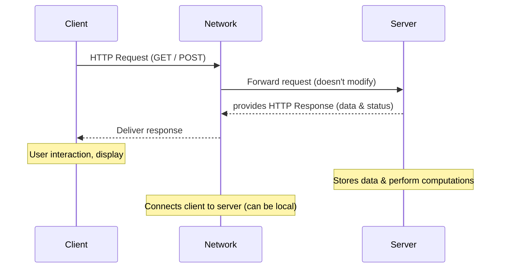

# Architectures
## Client ↔ Server Architecture

- **Machine Client**: may run without direct user interaction, e.g. software/antivirus updaters running in the *background*.
- **Local Systems**: both client & server run on same machine like *browser accessing a local database or `localhost` web server.*
- **Stateless Requests**: The server does not remember previous HTTP requests unless extra mechanisms like sessions, cookies, or tokens are used.

::: info throughout this course we will be primarily learning about client-server architecture with HTTP protocol
:::

## Distributed or peer-to-peer Architecture

- All peers are considered "**equivalent**" so no permanent central controller
  - If a peer fails⚠️-> automatically re-selects✅ another peer
  - The system keeps working even if some peers go offline
- Shared information and resources among **peers**
- Ex: *bittorrent, Blockchain, Distributed file systems*

:::info When you download a movie using a torrent:
- You download small pieces of the movie from many users
- At the same time, you upload the pieces you already have to others 

So, every downloader also becomes an uploader (Data can flow in both ways)
:::

source: https://em360tech.com/tech-articles/client-server-architecture-enterprise-it

::: details Design Pattern
A general, reusable solution to a commonly occurring problem within a given context in software design. 
- Designers observe patterns → reuse same codes for faster development
-  Indexed Metadata: information about create & update time and attachment type; this summarizes basic information for tracking
:::

### ⭐Checkout [Model-View-Controller Architecture](../week4/4-database-layer-MODEL#mvc-model-view-controller) from Week-4
