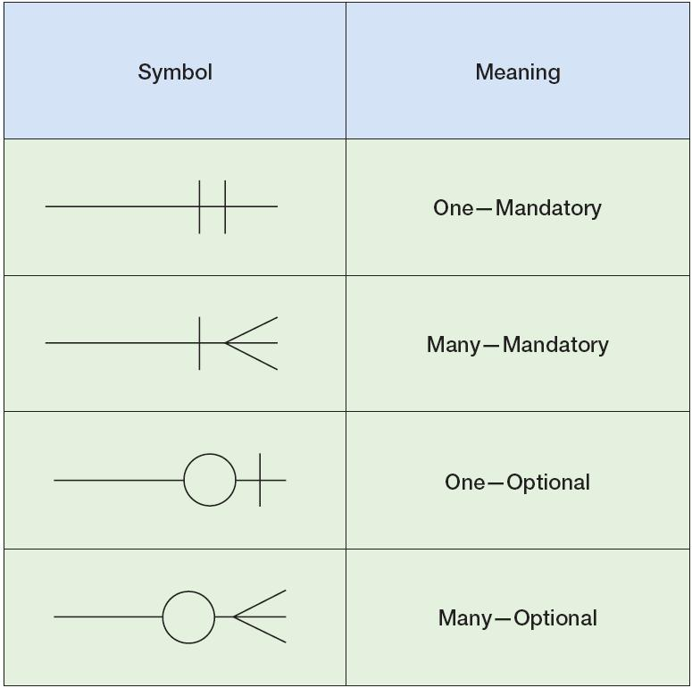

## MVC (Model-View-Controller)
MVC is a software design pattern that separates an interactive applications into Model (data), View (UI), and Controller (logic) to improve modularity, maintainability, and scalability.


It was originally introduced by *Trygve Reenskaug* while working at *Xerox PARC Smalltalk* in the late 1970s.

::: info Core idea
Separate what the application stores (data), how it is presented (UI),
and how user requests are handled (control flow).
MVC enforces this separation of concerns:

- UI changes shouldn’t break business logic
- database changes shouldn’t directly affect UI
- Business logic should not be mixed with HTML templates
:::

:::tabs

== Model
**What application knows (data and rules)**
- Stores Core data for the application and the validation constraints on data 
- Ex: `price >= 0 in Product Table, ID is unique in User Table`
- Searching & manipulation on databases. 
- Interacts with databases, files, or external APIs

== View
**What user sees (presentation)**
- User-interface of application
- Defines how information (received from Controller/Model) is presented (not how it is stored/processed)
- Ex: `HTML pages, server-side templates, Forms, rendered Charts`

== Controller
**What the app does? What should happen on user request?**
- “Business logic” - how to manipulate data
- Handles user actions by coordinating between *Model* and *View*<br>
Examples:
	- Deciding which dashboard to show after login
	- Handling button clicks or form submissions
	- Validating input and triggering model updates
:::

User uses <span style="font-weight:bold; color:rgb(240, 96, 118)"> Controller </span> → updates the <span style="font-weight:bold; color:rgb(98, 151, 208)"> Model </span> → Controller selects a <span style="font-weight:bold; color:rgb(152, 205, 137)"> View </span> → **User** sees rendered data

::: details
1. User fills Register form and clicks “Submit”
2. Request goes to the Controller
	- validates input (`unique email address, integer 10-digit phone number`)
	- updates the Model with New user record
3. `Model` updates database
4. `Controller` selects a View
5. `View` renders updated `Model` data
6. User sees the result
:::

## Spreadsheets vs RDBMS vs NoSQL

| Feature                        | **Spreadsheets (Excel / Google Sheets)**                                                                                                     | **RDBMS (SQL Databases)**                                                               | **NoSQL (MongoDB, CouchDB)**                                                             |
| ------------------------------ | -------------------------------------------------------------------------------------------------------------------------------------------- | --------------------------------------------------------------------------------------- | ---------------------------------------------------------------------------------------- |
| **Lookup & Cross-Referencing** | Possible using formulas like `VLOOKUP`, `INDEX/MATCH`, but becomes **harder** as data grows or multiple files | Powerful **JOINs**; relationships are clearly defined using **foreign keys** | Cross-referencing **not as natural** as `JOIN`; data is often duplicated (for performance) |
| **Data Relationships**         | Not automatic relationships; users must manually ensure   | **Strongly enforced** relationships using constraints                                   | Relationships are usually handled **in application code**, not the database              |
| **Stored Procedures / Logic**  | Limited to basic formulas & scripts (VBA, Google Apps Script)    | **Rich support**: stored `PROCEDURE`, `TRIGGER`, `FUNCTION`                                | Usually **no stored procedures**; limited server-side scripting                          |
| **Business Logic Support**     | Not suitable for complex or reusable logic   | Ideal for business rules, validations, automation                                       | Logic mostly lives in the application layer                                              |
| **Atomic Operations**          | No true atomicity; partial updates can occur                                                                                                 | **Fully atomic (ACID transactions)**                                                    | Atomic at **document level only**   |
| **Failure Handling**           | Manual recovery needed   | Automatic rollback on failure    | Rollback across multiple documents is limited                                            |
| **Scalability**                | Poor for large datasets                                                                                                                      | Scales well vertically, moderately horizontally                                         | Designed for **horizontal scaling**                                                      |
| **Best Use Case**              | Small data, analysis, quick calculations                                                                                                     | Structured data, ERP, banking like *Paypal, Visa, Oracle*      | used alongside SQL for Big data, flexible schemas, high-traffic aspects of *Instagram, Netflix, Youtube, Twitter, Swiggy*   |


# Database Example: **Library Management System**

A college library wants to keep track of:
##### 📌 `Students`

| student_id | name  | dept |
| ---------- | ----- | ---- |
| S101       | Aditi | CS   |
| S102       | Rohan | EE   |
| S103       | Meera | CS   |


##### 📌 `Books`

| book_id | title            | category |
| ------- | ---------------- | -------- |
| B1      | Database Systems | CS       |
| B2      | Calculus         | Math     |
| B3      | Physics Basics   | Physics  |


##### 📌 `BorrowedBooks` (Many-to-Many)

| student_id | book_id | borrow_date |
| ---------- | ------- | ----------- |
| S101       | B1      | 2024-01-10  |
| S101       | B2      | 2024-01-15  |
| S102       | B3      | 2024-01-12  |
| S103       | B1      | 2024-01-18  |

---

## ER diagrams

- Vertical line `|` → One (Exactly one instance of the entity)<br>Ex. *A borrow record must be linked to exactly one student*
- Circle `O` → Optional (Zero or more participate)<br>Ex. *A student may or may not have borrowed books.*
- Crow's feet - Many<br> Ex. *A student can borrow many books.*
4️- Second Vertical Line `||` → Mandatory (At least one)<br> Ex. Every borrow record must have at least one book


# Case 1: Create Table (Datatypes + Constraints)

```sql
CREATE TABLE Students (
  student_id CHAR(4) PRIMARY KEY,
  name VARCHAR(20) NOT NULL,
  dept VARCHAR(5)
);
```

👉 Shows: `CHAR`, `VARCHAR`, `PRIMARY KEY`, `NOT NULL`

---

# Case 2: Insert Data

```sql
INSERT INTO Students
VALUES ('S104', 'Kunal', 'ME');
```

👉 Adds a new student to the library system

---

# Case 3: Simple SELECT + WHERE

### ❓ Find all CS students
👉 filtering using `WHERE`

:::code-group
```sql [SQL]
SELECT name
FROM Students
WHERE dept = 'CS';
-- WHERE category IN ('CS', 'Math'); for >1 departments
```

```txt [output]
Aditi
Meera
```
:::


---

# Case 4: JOIN (Who borrowed which book?)

::: code-group
```sql [SQL]
SELECT s.name, b.title
FROM Students s
JOIN BorrowedBooks bb
  ON s.student_id = bb.student_id
JOIN Books b
  ON b.book_id = bb.book_id;
```


```txt [output]
Aditi   Database Systems
Aditi   Calculus
Rohan   Physics Basics
Meera   Database Systems
```
:::

---

# Case 5: Condition with JOIN

### ❓ Find students who borrowed **Database Systems**

::: code-group
```sql [SQL]
SELECT s.name
FROM Students s
JOIN BorrowedBooks bb
  ON s.student_id = bb.student_id
JOIN Books b
  ON b.book_id = bb.book_id
WHERE b.title = 'Database Systems';
```

```txt [output]
Aditi
Meera
```
:::


# Case 6: Aggregation (COUNT + GROUP BY + HAVING)

### ❓ How many books has each student borrowed?

```sql
SELECT student_id, COUNT(*) AS books_borrowed
FROM BorrowedBooks
GROUP BY student_id;
ORDER BY name ASC;
```

### ❓ Students who borrowed **more than 1 book**

::: code-group
```sql [DSL]
SELECT student_id, COUNT(*) AS books_borrowed
FROM BorrowedBooks
GROUP BY student_id
HAVING COUNT(*) > 1;
```


```txt [output]
S101   2
```
:::


### DELETE

```sql
DELETE FROM BorrowedBooks
WHERE student_id = 'S102';
```