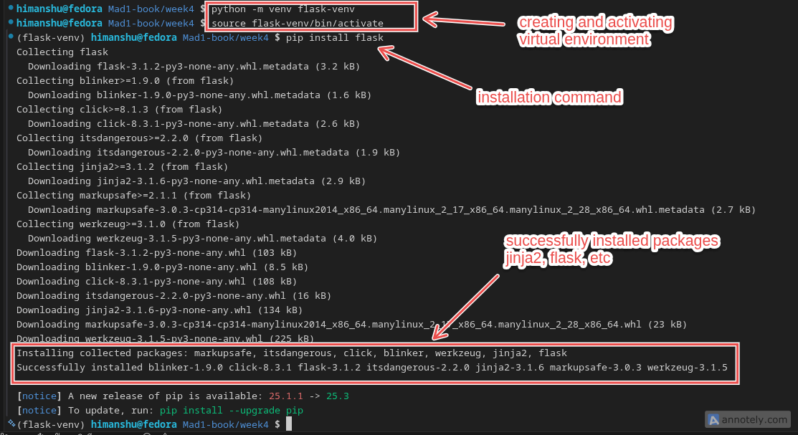
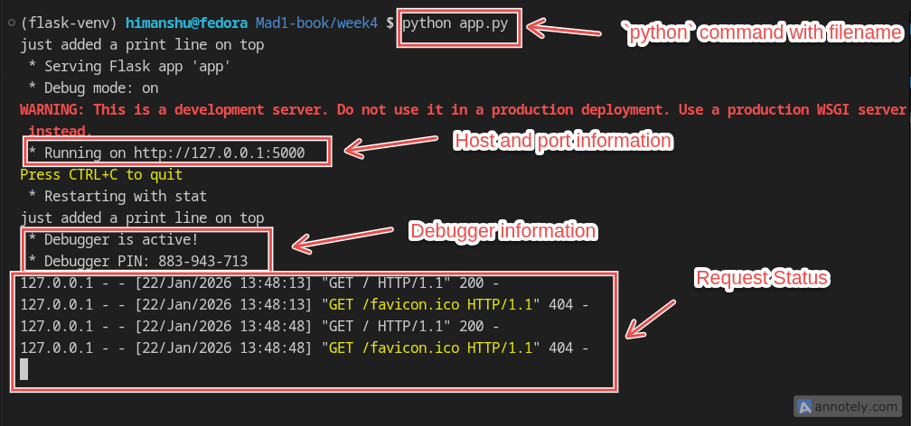
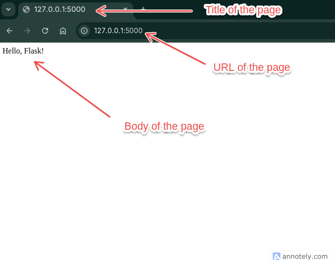
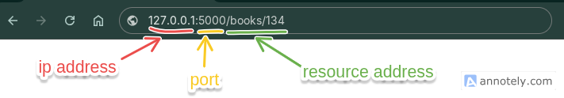

# Flask

Flask is a lightweight web framework for Python. It is designed to make it easy to create web applications quickly and with minimal code.

## Why Flask?

Flask is popular for several reasons:

- **Simplicity**: Flask has a simple and easy-to-understand API, making it accessible for beginners.
- **Flexibility**: Flask is unopinionated, allowing developers to choose their own tools and libraries.
- **Extensibility**: Flask has a rich ecosystem of extensions that can add functionality such as database integration, form handling, authentication, and more.
- **Lightweight**: Flask is minimalistic, providing only the essential features needed to build web applications, which helps keep the application lightweight and fast.
- **Built-in Development Server**: Flask comes with a built-in development server that makes it easy to test and debug applications during development.
- **Jinja2 Templating**: Flask uses the Jinja2 templating engine, which allows for dynamic HTML generation and separation of logic from presentation.
- **RESTful Request Handling**: Flask makes it easy to create RESTful APIs by providing tools for handling HTTP requests and responses.
- **Strong Community Support**: Flask has a large and active community, which means there are plenty of resources, tutorials, and third-party libraries available.

Overall, Flask is a great choice for developers who want to build web applications quickly and efficiently while maintaining flexibility and control over their application's architecture.

## Installation

To install Flask, we can use pip, the Python package manager. Open our terminal or command prompt and run the following command:

:::code-group

```bash[Windows]
python -m venv flask-env
flask-env\Scripts\activate
pip install Flask
```

```bash[macOS/Linux]
python3 -m venv flask-env
source flask-env/bin/activate
pip install Flask
```

:::

We should see output indicating that Flask has been successfully installed:



## Basic Concepts

In Flask, the communication between the client and server is handled through **routes**. A route is a URL pattern that is associated with a specific function in the Flask application. When a client makes a request to a specific URL, Flask matches the URL to the corresponding route and executes the associated function.

Here's a simple example of a Flask application with a single route:

```python
from flask import Flask

app = Flask(__name__)

@app.route('/')
def home():
    return "Hello, Flask!"

if __name__ == '__main__':
    app.run(debug=True)

```

Here, we have defined a route for the root URL (`/`). When a client accesses this URL, the `home` function is executed, and "Hello, Flask!" is returned as the response.

To run the application, save the code in a file named `app.py` and execute it using the following command:

```bash
python app.py
```

This will start the Flask development server, and we can access the application by navigating to `http://127.0.0.1:5000/` in our web browser.

::: tabs
== terminal

We will see output similar to this on our terminal:


== browser

When we access the root URL, we should see "Hello, Flask!" displayed in our browser.


:::

:::details Try it yourself

1. Create a new directory for your Flask application and navigate into it.
2. Create a new file named `app.py` and copy the example code into it.
3. Open your terminal or command prompt, navigate to the directory where `app.py` is located, and run the command `python app.py` to start the Flask development server.
4. Open your web browser and go to `http://localhost:5000/` to see the "Hello, there! This is my first Flask app." message.

```python
from flask import Flask

app = Flask(__name__)

@app.route('/')
def home():
    return "Hello, there! This is my first Flask app."

if __name__ == '__main__':
    app.run(debug=True)
```

:::

## URL Structure and Parameters

The url that a client uses to access a Flask application consists of several components:

- **Scheme**: The protocol used for communication (e.g., `http` or `https`).
- **Host**: The domain name or IP address of the server e.g., (`localhost` or `127.0.0.1`) or the network location of the server.
- **Port**: The port number on which the server is listening for requests. The default is `5000` for Flask development server, but we specify a different port if needed.
- **Path**: The specific route or resource being requested (e.g., `/`, `/about`, `/user/<username>`).It is the part that follows the port number up to any query parameters.
- **URL Parameters**: Additional data that can be passed in the URL to provide more context for the request. There are two types of URL parameters:
  - **Path Parameters**: Variables that are part of the URL path itself (e.g., `/user/<username>`).
  - **Query Parameters**: Optional parameters that can be included in the URL to provide additional information (e.g., `?id=123&name=John`).  

Flask allows us to define routes with variable parts, which can be used to capture values from the URL. This is done using angle brackets (`< >`) in the route definition.
For example, consider the following route definition:

```python
@app.route('/user/<username>')
def show_user_profile(username):
    return f'User: {username}'
```

In this example, the route `/user/<username>` captures the value of `username` from the URL and passes it as an argument to the `show_user_profile` function. If a client accesses the URL `/user/john`, the response will be "User: john".

Flask also supports variable rules that allow us to specify the type of the variable. For example:

```python
@app.route('/post/<int:post_id>')
def show_post(post_id):
    return f'Post ID: {post_id}'
```

Here `post_id` is defined as an integer so when a client types a value flask will try to convert it to an integer. If the conversion fails (e.g., if the client accesses `/post/abc`), Flask will return a **404 error**.

Similar to `int` flask supports other variable types like `float`, `path` (which accepts slashes), and `uuid` and the default type is `string`.

### Delimiters in URL

Flask recognises certain characters as delimiters in URLs. These characters are used to separate different parts of the URL and have special meanings. Some common delimiters include:

- `/` (forward slash): Used to separate different segments of the URL path.
- `#` (hash): Indicates a fragment identifier, which points to a specific section within a resource. This is for internal page navigation and is not sent to the server.
- `?` (question mark): Indicates the start of query parameters in the URL.
- `=` (equals sign): Used to assign values to query parameters.
- `&` (ampersand): Used to separate multiple query parameters.
- `+` (plus sign): Represents a space character in URL encoding.

:::details routing based on number of occurrences of `/`

If we define a route without a trailing slash, Flask will not match URLs with a trailing slash to that route. For example:

```python
@app.route('/about')
def about():
    return "About Page"
```

In this case, accessing `/about/` (with a trailing slash) will result in a 404 error. However, if we define the route with a trailing slash:

```python
@app.route('/about/')
def about():
    return "About Page"
```

Now, accessing `/about` (without a trailing slash) will automatically redirect to `/about/`, and the route will be matched successfully.

More than one trailing slash: **Flask treats multiple trailing slashes as a single slash**. For example, accessing `/about///` will be treated the same as `/about/`.

*This behavior is not very predictable in nature and it is generally recommended to use a single trailing slash for consistency and clarity in our URL design.*

:::

## Working of Flask(simplified)

1. **Client Request**: A client (usually a web browser) sends an HTTP request to the Flask server by accessing a specific URL. That URL contains the host `127.0.0.1 or localhost` and port `5000` information. This is information is used to identify the server and the specific application running on it. URL also contains the route path (e.g., `/` for the home page) which tells the server which resource the client is requesting.


2. **Server Processing**: The Flask server receives the request and processes it. It matches the requested URL to the defined routes in the application. If a match is found, the corresponding function (view function) is executed.

3. **Response Generation**: The view function generates a response, which can be in the form of HTML, JSON, or a few other format. This response is then sent back to the client.<br>
*Flask route functions must return a valid response type (usually a string or a Response object). Returning raw types like **integers** or **floats** are not allowed unless they are converted to strings or wrapped in a response.*

## Debug Mode

When running a Flask application in debug mode, the server provides additional features that are useful during development:

- **Automatic Reloading**: The server automatically reloads the application whenever it detects changes in the source code. This means we don't have to manually restart the server every time we make a change, which speeds up the development process.
- **Detailed Error Messages**: If an error occurs in the application, Flask provides detailed error messages in the browser, including a traceback of the error. This helps developers quickly identify and fix issues in their code.
- **Interactive Debugger**: Flask includes an interactive debugger that allows developers to inspect the state of the application at the point of an error. This can be very helpful for diagnosing complex issues.
To enable debug mode, we can set the `debug` parameter to `True` when calling the `app.run()` method, as shown in the previous examples:

```python
if __name__ == '__main__':
    app.run(debug=True)
```

But when deploying the application to a production environment, it is important to disable debug mode for security reasons. In production, we should set `debug` to `False` or omit it entirely.

### Example: A Simple Flask Application

Here's an example of a simple Flask application that demonstrates routing:

```python
from flask import Flask

app = Flask(__name__)

students = {
    1: "Alice",
    2: "Bob",
    3: "Charlie"
}

@app.route('/')
def home():
    return "Welcome to the Student Portal!"

@app.route('/student/<int:student_id>')
def get_student(student_id):
    student_name = students.get(student_id, "Student not found")
    return f"Student ID: {student_id}, Name: {student_name}"

if __name__ == '__main__':  
    app.run(debug=True)
```

In this example, we have defined two routes:

1. The root route (`/`) returns a welcome message.
2. The `/student/<int:student_id>` route takes a student ID as a parameter and returns the corresponding student's name.

To run the application, save the code in a file named `app.py` and execute it using the following command:

```bash
python app.py
```

We can access the application by navigating to `http://127.0.0.1:5000/` for the home page and `http://127.0.0.1:5000/student/1` to get information about the student with ID 1.

:::details Try it yourself

```python
from flask import Flask

app = Flask(__name__)

fruits = ["Apple", "Banana", "Cherry"]

@app.route('/')
def home():
    return "Welcome to the Fruit Store!"

@app.route('/fruits/')
def get_fruit():
    return fruits  # or jsonify(fruits)

if __name__ == '__main__':
    app.run(debug=True)
```

Here python list will be automatically converted to JSON format by Flask. In older Flask versions, lists had to be wrapped with jsonify() explicitly.

:::

## Flask Application Structure

A typical Flask application usually has the following structure:

```text
our-application/                # project root
├── static/                      # static files (CSS, JavaScript, images)
├── templates/                   # HTML templates
├── app.py                       # main Flask application (routes, app setup)
└── requirements.txt             # project dependencies
```

This structure helps organize the different components of the application, making it easier to manage and maintain. Though this structure is a convention, Flask is flexible and allows us to organize our application in various ways based on our needs.

## Summary

In this module we learned about

- What is Flask and why it is used
- How to install Flask
- Basic concepts of Flask including routes and view functions
- URL structure and parameters in Flask applications
- Example of a simple Flask application
- Typical structure of a Flask application

In the next module, we will explore template rendering in flask.

### Additional resources:

- [Flask Official Documentation](https://flask.palletsprojects.com/)
