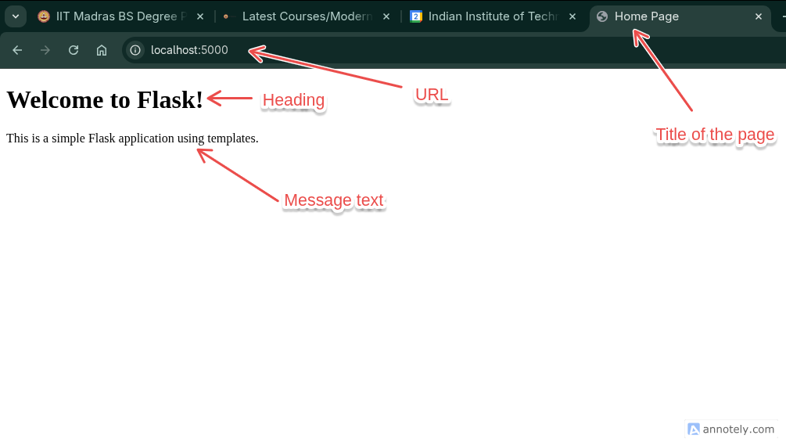

# Template Rendering in Flask

In web development, templates are used to separate the presentation layer (HTML/CSS) from the business logic (Python code). Flask uses [Jinja2](../week3/3-jinja2.md) as its default templating engine, allowing HTML templates to be rendered dynamically. This allows developers to create reusable HTML structures and populate them with data from the server.

## Setting Up Templates in Flask

To use templates in Flask, we need to create a folder named `templates` in the root folder of our Flask application. This is where we will store our HTML template files. The folder structure should look similar to this:

```text
our_flask_app/
│├── app.py
│└── templates/
│    └── index.html
```

Alternatively, we can specify a different folder for templates by passing the `template_folder` parameter when creating the Flask app instance:

```python
app = Flask(__name__, template_folder='my_templates')
```

### Including Static Files

In addition to templates, we may also want to include static files such as CSS, JavaScript, and images in our Flask application. Flask looks for static files in a folder named `static` by default. The folder structure would look like this:

```text
our_flask_app/
│├── app.py
│├── static/
││   ├── styles.css
││   └── script.js
└── templates/
    └── index.html
```

We can change the static folder name by passing the `static_folder` parameter when creating the Flask app instance:

```python
app = Flask(__name__, static_folder='my_static')
```

:::info

**How to link static files in templates?**
To link static files in our HTML templates, we can use the `url_for` function provided by Flask. This function generates the appropriate URL for the static files. Here is an example of how to include a CSS file in our HTML template:

```html
<link rel="stylesheet" href="{{ url_for('static', filename='styles.css') }}">
```

The function url_for('static', filename='styles.css') generates the correct URL for the `styles.css` file located in the `static` folder. More about this function we will cover in the next module on flask features.
:::

## Rendering Templates

Here is an example of a simple Flask application that uses templates:

### folder Structure

```text
our_flask_app/
│├── app.py
└── templates/
    └── index.html
```

#### templates/index.html

```html
<!DOCTYPE html>
<html lang="en">
<head>
    <meta charset="UTF-8">
    <meta name="viewport" content="width=device-width, initial-scale=1.0">
    <title>{{ title }}</title>
</head>
<body>
    <h1>{{ heading }}</h1>
    <p>{{ message }}</p>
</body>
</html>
```

#### app.py

```python
from flask import Flask, render_template

app = Flask(__name__)

@app.route('/')
def home():
    return render_template('index.html', title='Home Page', heading='Welcome to Flask!', message='This is a simple Flask application using templates.')

if __name__ == '__main__':
    app.run(debug=True)
```

In this example, we import the `render_template` function from flask library. The `home` function uses `render_template` to render the `index.html` template and passes dynamic data (title, heading, and message) to it.

When we run this Flask application and navigate to `http://localhost:5000/`, we will see the rendered HTML page with the content we passed through variables.



## Template Inheritance

We have already conceptually covered template inheritance in the previous module on Jinja2 but we did not use it there because of Environment setup constraints. In Flask(render_template), the environment is already set up for us, so we can directly use template inheritance.

Here is an example of how to use template inheritance in Flask:

### folder Structure

```text
our_flask_app/
│├── app.py
└── templates/
    ├── base.html
    └── home.html
```

#### templates/base.html

```html
<!DOCTYPE html>
<html lang="en">
<head>
    <meta charset="UTF-8">
    <meta name="viewport" content="width=device-width, initial-scale=1.0">
    <title>My Website</title>
</head>
<body>
    <header>
        <h1>My Website Header</h1>
    </header>
    <main>
        
    </main>
    <footer>
        <p>My Website Footer</p>
    </footer>
</body>
</html>
```

#### templates/home.html

```html


Home Page


    <h2>Welcome to {{ title }}'s Home Page!</h2>
    <p>This is the content of the home page.</p>

```
#### app.py

```python
from flask import Flask, render_template

app = Flask(__name__)

@app.route('/')
def home():
    return render_template('home.html', title='My Website')

if __name__ == '__main__':
    app.run(debug=True)
```

This will generate a complete HTML page by combining `base.html` and `home.html`, resulting in the following HTML:

<TemplateInheritanceViewer />

::: details Explanation

```html
<!DOCTYPE html>
<html lang="en">
<head>
    <meta charset="UTF-8">
    <meta name="viewport" content="width=device-width, initial-scale=1.0">
    <title>Home Page</title>
</head>
<body>
    <header>
        <h1>My Website Header</h1>
    </header>
    <main>
        <h2>Welcome to My Website's Home Page!</h2>
        <p>This is the content of the home page.</p>
    </main>
    <footer>
        <p>My Website Footer</p>
    </footer>
</body>
</html>
```

This demonstrates how template inheritance can be effectively used in Flask applications to create a consistent layout across multiple pages while allowing for dynamic content for each page.

:::
## Static File Serving

Flask automatically serves static files from the `static` folder. So we can access static files using the `/static/` URL path. For example, if we have a CSS file named `styles.css` in the `static` folder, we can access it in our HTML templates like this:

### Folder Structure

```text
our_flask_app/
│├── app.py
├── static/
││   └── styles.css
└── templates/
    └── index.html
```

This allows us to host static files such as CSS, JavaScript, and images alongside our Flask application. **Though this method is not recommended for production use, as dedicated web servers like Nginx or Apache are better suited for serving static content efficiently.**

## Summary

Flask's templating system, powered by Jinja2, provides a powerful way to create dynamic web pages by separating the presentation layer from the business logic. By using templates, we can create reusable HTML structures, include static files, and implement template inheritance to maintain a consistent layout across our web application.

If we are not familiar with Jinja2 templating syntax, it is recommended to review the [Jinja2 page](../week3/3-jinja2.md) to understand the various features and capabilities it offers.

In the next module, we will explore how to handle forms and user input in Flask applications.

### Additional resources:

- [Flask Documentation - Templating](https://flask.palletsprojects.com/en/2.3.x/templating/)
- [Jinja2 Documentation](https://jinja.palletsprojects.com/en/3.1.x/)
- [HTTP status codes](../week1/1-network-history-TCP.md#status-codes)
